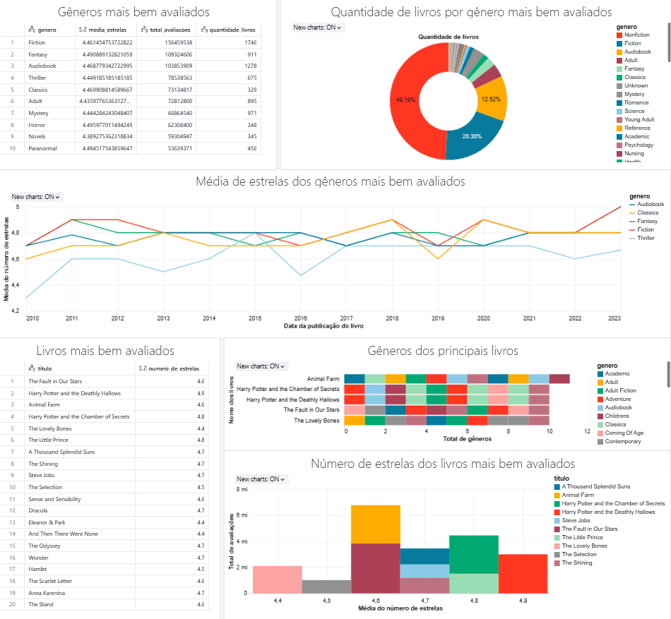

# Recomendador de livros

O projeto tem como finalidade apresentar etapas de Engenharia, Ciência e Análise de Dados nos dados fornecidos pela plataforma *__Kaggle__*, isto é, fazer o tratamento dos dados coletados para serem utilizados em duas vertentes:
- recomendador de livros;
- análise em cima do que os dados trazem sobre o consumo de livros no *__Kindle da Amazon__* e *__Goodreads__*.

> [!NOTE]
> O projeto visa colocar conhecimentos em prática. Ao fazer isso, serviços como Azure e Databricks não seriam visualizados no repositório. Contudo, será incluído evidências de seu uso e como para uma eventual tirada de dúvidas de como fazer o processo e colaborar com a comunidade de como fiz.

Diante destas perguntas, tem-se o [dashboard](https://giovannarmendes.github.io/Recomendador_de_livros/Analise_dos_dados/analise_dos_dados.html) (site para acessar o _dashboard_).
- Quais são os gêneros de livros mais bem avaliados?
- Quais são os principais livros com esses gêneros;
- Quais são os gêneros associados a esses livros?

