# Intruções das criações e configurações do ambiente de execução do projeto

## GitHub

Instruções para iniciar um repositório remote e vinculá-lo ao do _GitHub_:
* ```git init```;
* ```git remote add <remote> <url https>```;
* ```git pull <remote-name> <local-branch-name>```.

## Azure

### Etapa 1

Para iniciar o projeto, é necessário criar uma conta na _Azure_ (podendo ser: pague conforme o uso ou gratuita por 30 dias). Para ambos os casos, é preciso tem um cartão de crédito.

Feito isso, inicia-se a configuração do ambiente para o projeto juntamente com o _Databricks_.

### Etapa 2

Uma das primeira etapas que acho importante é a criação de um orçamento. Isso para fiscalizar o quanto o seu projeto está gastando. Para isso, vá no __Gerenciamento de Custos__ -> __Orçamentos__ -> __Adicionar__ e define as informações exigidas de acordo com os seus dados.

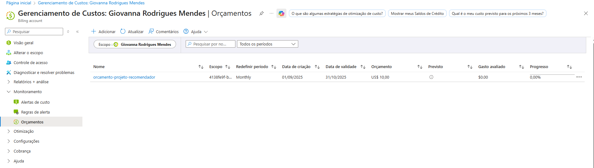
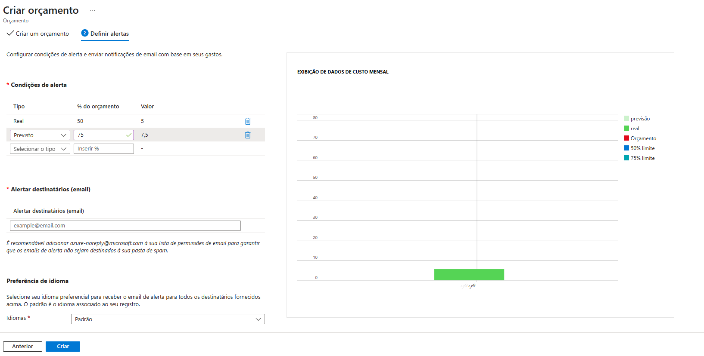

### Etapa 3

Posteriormente, cria-se uma conta de armazenamento para guardar seus dados. Para isso, vá no __Centro de armazenamento__ -> __Criar__ e informe os dados necessários para sua criação.

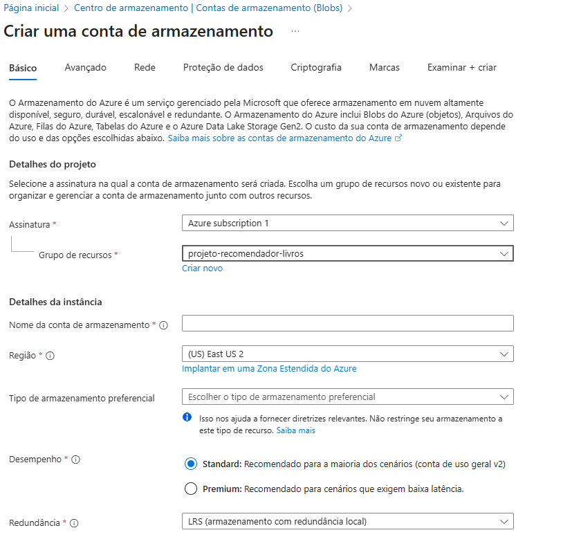
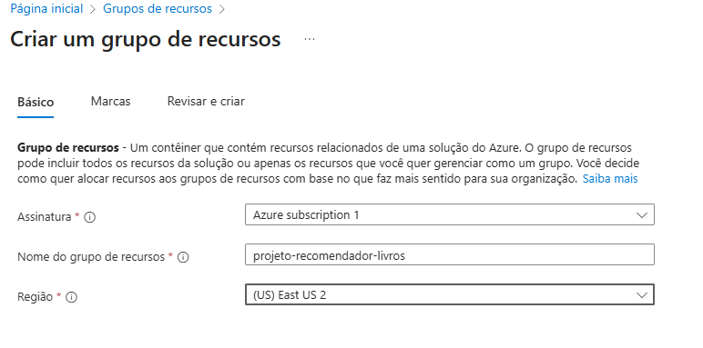

Vale destacar que, necessita de um grupo de recursos. Você pode criá-lo nessa etapa. Como apresentado na imagem acima.

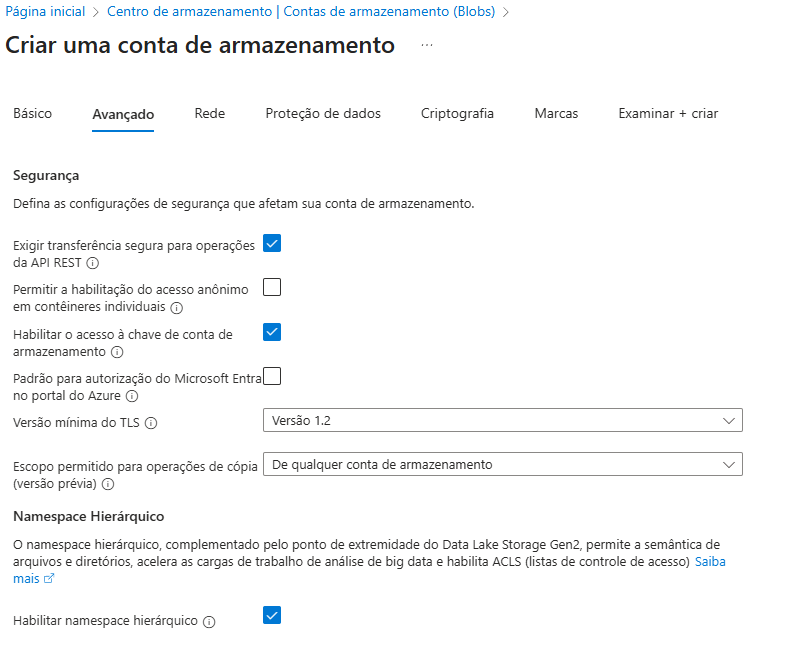

Já o _Namespace hierárquico_ é importante ser acrescentado por conta da sua forma de organização ser do __Data Lake Storage Gen2__. Para saber mais sobre o [_Namespace hierárquico_](https://learn.microsoft.com/pt-br/azure/storage/blobs/data-lake-storage-namespace), aqui está o _link_ na documentação do _Microsoft Learn_: https://learn.microsoft.com/pt-br/azure/storage/blobs/data-lake-storage-namespace.

### Etapa 4

Cria-se um container e pastas dentro deste como apresentado.

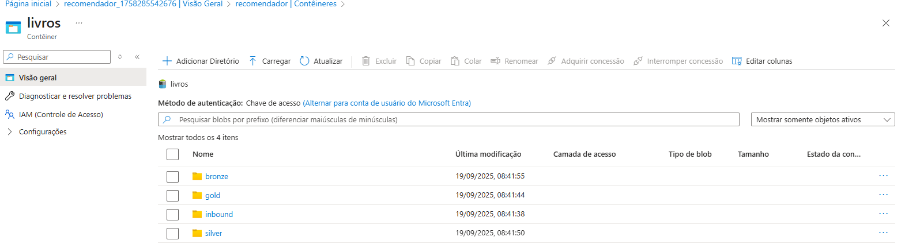

### Etapa 5

Agora, deve-se criar o __Azure Databricks__ pesquisando-o na barra de pesquisa e clicar em __Criar__. Depois, insira as informações necessárias como foi feito na imagem.

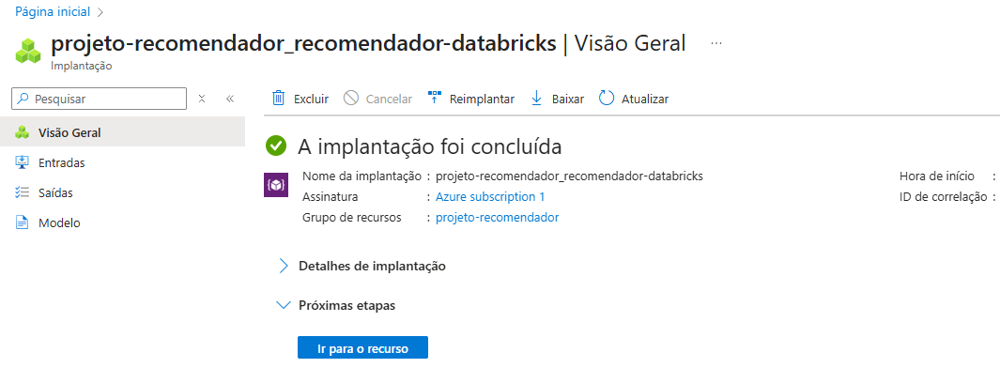

Dentro do __Databricks__, é necessário ativar o __DBFS__.

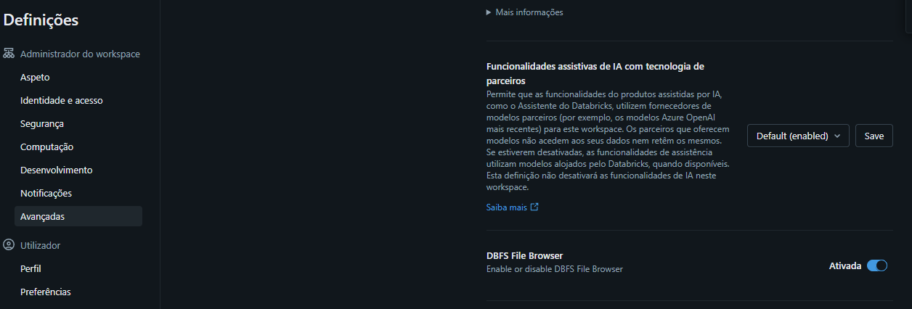

### Etapa 6

Para a integração do __Azure Databricks__ com as pastas presentes nas __Contas de armazenamento__, é preciso seguir os seguintes passos:

1. __Conector de acesso para Azure Databricks__ -> __Criar__:

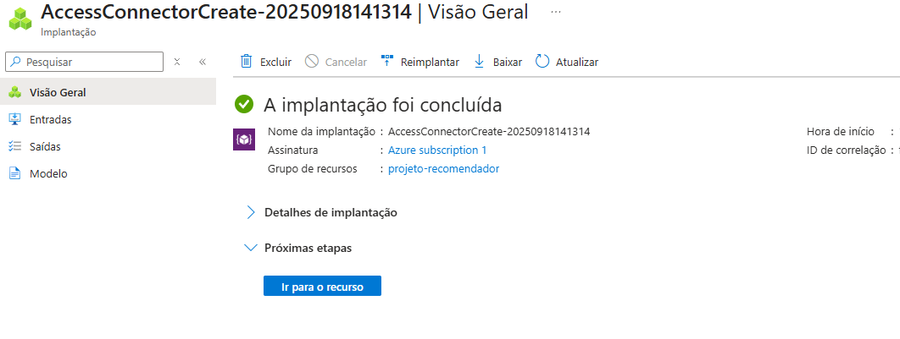

2. Dentro da __Conta de armazenamento__, entre no __IAM__ e insira o conector criado anteriormente:

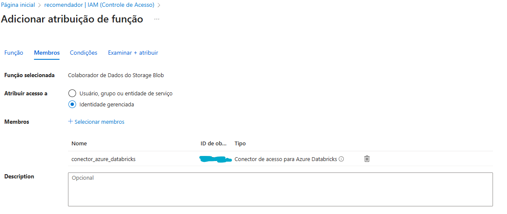

3. __Catálogo__ -> __Credenciais__:

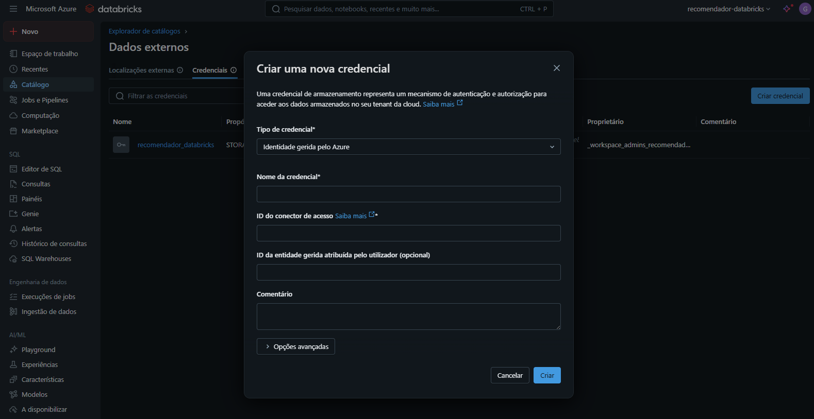

4. __Catálogo__ -> __Localizações externas__:

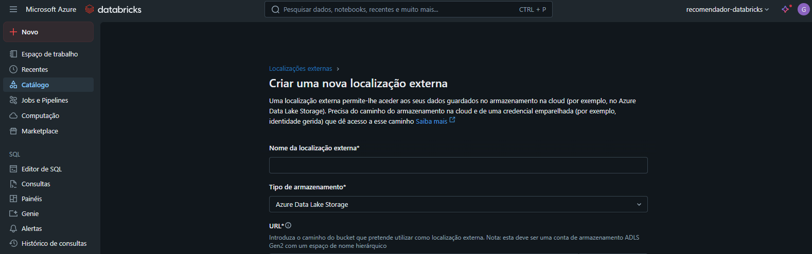

### Etapa 7

Para fazer a integração com o __GitHub__, deve-se ir no __Novo__ e criar uma pasta __Git__. Mas antes disso, é preciso criar um _token_ no __GitHub__ e inserí-lo no __Databricks__ na parte de __Contas vinculadas__.

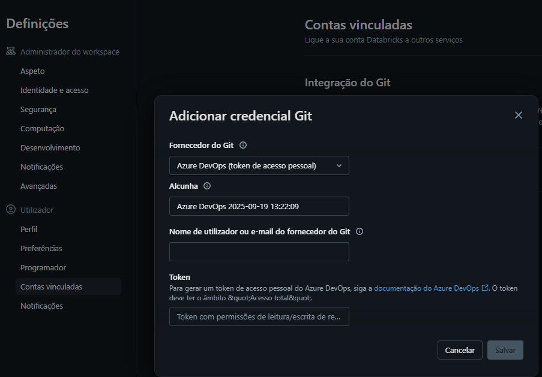
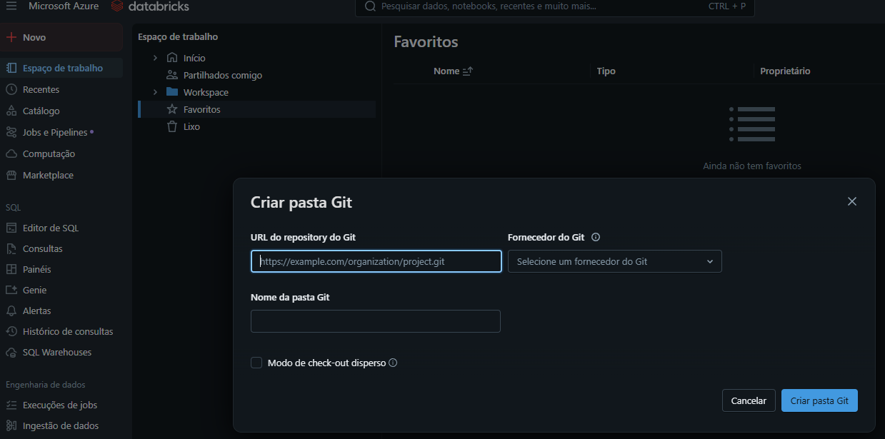